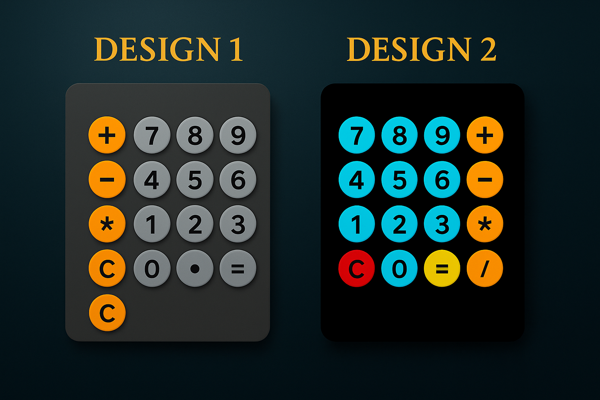

# Calculator Designs
- You have two different calculator designs here.  
- They are basic calculators made with: `html`, `css` and `js`.  
- They have a pretty nice appearance and can be used without problems because they have `no bugs`.  
- Both use the `eval()` function to calculate the value that is in the `input`.



## 📦 How to Run

Clone the repo
```bash
git clone https://github.com/ValyMnDul/Calculator.git
```
Enter the "Calculator" directory
```bash
cd Calculator
```
If you want the first design, go to the `Design 1` directory and open the `index.html` file.  
```bash
cd Design\ 1 && open index.html
```
If you want the second design, go to the `Design 2` directory and open the `Index.html` file.
```bash
cd Design\ 2 && open Index.html
```  
## 📄 License
This project is open-source under the MIT License.
  
